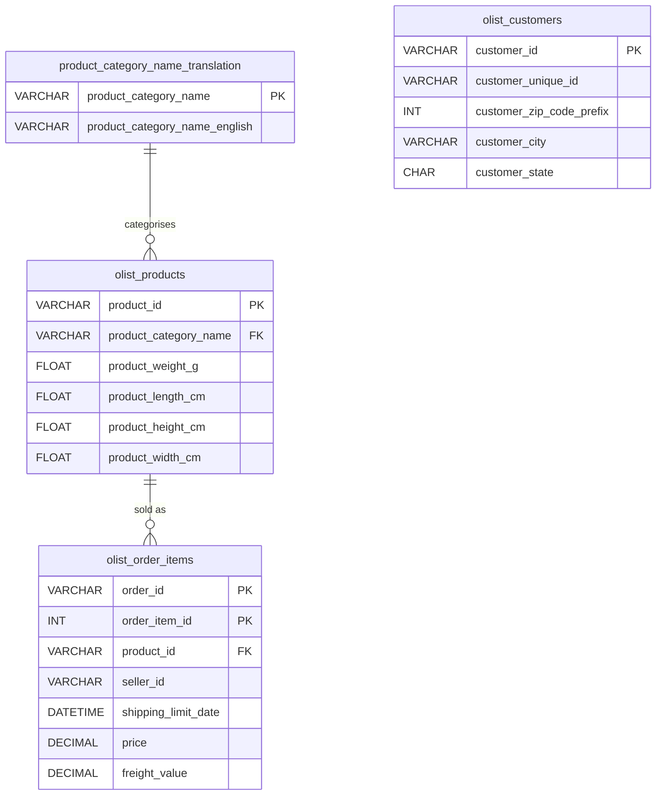

# Brazilian E-Commerce Database

A relational database built on real marketplace data from Olist, a Brazilian e-commerce platform, with a normalised schema, referential integrity, a targeted indexing strategy and business analysis queries. The project covers **112,650 order items**, **32,951 products** and **99,441 customers**.

Developed as the final project for a Database Management course.

---

## Key findings

| Question | Result |
|---|---|
| Which categories generate the most revenue? | Health & beauty (R$ 1.26M), watches & gifts (R$ 1.21M) and bed, bath & table (R$ 1.04M) lead, out of R$ 13.6M in total item sales |
| Where are the customers? | São Paulo alone accounts for 42% of customers, followed by Rio de Janeiro (13%) and Minas Gerais (12%) |
| Which categories carry the highest shipping costs? | Computers, home appliances and mattresses & upholstery, all bulky items, have the highest average freight per item |
| Which categories have the largest catalogues? | Bed, bath & table (3,029 products), sports & leisure (2,867) and furniture & decor (2,657) |

Revenue is the sum of item prices, excluding freight.

---

## Schema



| Table | Rows | Purpose |
|---|---|---|
| `product_category_name_translation` | 73 | Maps Portuguese category names to English |
| `olist_products` | 32,951 | Product catalogue with category and physical dimensions |
| `olist_order_items` | 112,650 | One row per item sold, with price and freight cost |
| `olist_customers` | 99,441 | Customer location (city, state, ZIP prefix) |

### Design decisions

- **Composite primary key** on `olist_order_items (order_id, order_item_id)`, since an order can contain several items
- **Foreign keys** from order items to products and from products to category translations, so every sale points to a real product and every product to a known category
- **`DECIMAL(10,2)` for money** (`price`, `freight_value`) to avoid floating-point rounding errors
- **Nullable product category**, because 610 products in the source data have no category

---

## Indexing strategy

Indexes were chosen to match the joins and groupings used in the analysis queries:

| Index | Columns | Supports |
|---|---|---|
| `idx_order_items_product_id` | `olist_order_items (product_id)` | Joins from order items to products |
| `idx_order_items_product_price` | `olist_order_items (product_id, price)` | Revenue aggregation per product |
| `idx_products_category` | `olist_products (product_category_name)` | Joins and grouping by category |
| `idx_products_weight_category` | `olist_products (product_category_name, product_weight_g)` | Weight analysis per category |
| `idx_customers_state` | `olist_customers (customer_state)` | Customer distribution by state |

---

## Analysis

`Analysis - DBM (Final Paper).sql` contains two sets of queries.

**Quick overview:** units sold per product, products per category, revenue per product and per category, customers per state and average product weight per category.

**Business analysis:**

| # | Query | Business question |
|---|---|---|
| 1 | Total revenue by category | Which segments drive sales? |
| 2 | Average item price by category | How does pricing differ across categories? |
| 3 | Products per category | Where is the catalogue concentrated? |
| 4 | Top 10 best-selling products | Which products need the most inventory attention? |
| 5 | Customers by state | Where is the market concentrated? |
| 6 | Product weight vs. price | Does product size relate to price? |
| 7 | Average freight cost by category | Which categories are most expensive to ship? |

Example: revenue by category

```sql
SELECT t.product_category_name_english AS category,
       SUM(oi.price) AS total_revenue
FROM olist_order_items oi
JOIN olist_products p ON oi.product_id = p.product_id
JOIN product_category_name_translation t
  ON p.product_category_name = t.product_category_name
GROUP BY t.product_category_name_english
ORDER BY total_revenue DESC;
```

---

## Getting started

### Prerequisites

- MySQL 8.0+ (or MariaDB 10.x)
- Local file loading enabled on the server: `SET GLOBAL local_infile = 1;`

### Setup

Run every command from the repository root, because the load script uses relative file paths.

```bash
git clone https://github.com/JRBaiao/Database-Management-Project.git
cd Database-Management-Project

# 1. Create the database, tables and indexes
mysql -u <user> -p < "Table Creation - DBM (Final Paper).sql"

# 2. Load the CSV data
mysql --local-infile=1 -u <user> -p < load_data.sql

# 3. Run the analysis
mysql -u <user> -p Brazil_Ecommerce_DB < "Analysis - DBM (Final Paper).sql"
```

`load_data.sql` handles three quirks of the source files: two use semicolons and Windows line endings while the others use commas, empty values must become `NULL`, and two product categories are missing from the translation file and are added before the products are loaded. The script ends with a row count check.

---

## Project structure

```
├── Table Creation - DBM (Final Paper).sql   # Schema, constraints and indexes
├── load_data.sql                            # Loads the CSV files
├── Analysis - DBM (Final Paper).sql         # Overview and business queries
├── olist_products_dataset.csv
└── Brazilian E-Commerce Public Dataset/
    ├── olist_customers_dataset.csv
    ├── olist_order_items_dataset.csv
    └── product_category_name_translation.csv
```

---

## Limitations and next steps

- **Customers are not yet linked to sales.** The link between customers and order items runs through the Olist `orders` table, which is not included. Adding it would enable customer-level questions such as revenue by state or repeat purchase rates.
- **No time dimension.** Without order dates, trends and seasonality can't be analysed. The `orders` table would also solve this.
- **Reviews and geolocation** tables were drafted in the schema script but dropped from the final model; they are natural extensions for satisfaction and delivery analysis.
- **Views** for the recurring analysis queries would make them reusable from BI tools.

---

## Data source and license

The data comes from the [Brazilian E-Commerce Public Dataset by Olist](https://www.kaggle.com/datasets/olistbr/brazilian-ecommerce), published on Kaggle under the **CC BY-NC-SA 4.0** license.
